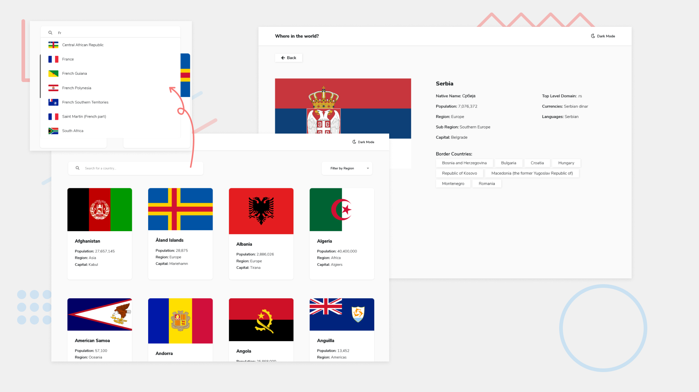
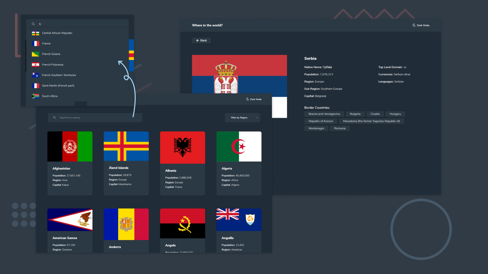

# Frontend Mentor - REST Countries API with color theme switcher solution

This is a solution to the [REST Countries API with color theme switcher challenge on Frontend Mentor](https://www.frontendmentor.io/challenges/rest-countries-api-with-color-theme-switcher-5cacc469fec04111f7b848ca). Frontend Mentor challenges help you improve your coding skills by building realistic projects. 

## Table of contents

- [Overview](#overview)
  - [The challenge](#the-challenge)
  - [Screenshot](#screenshot)
  - [Links](#links)
- [My process](#my-process)
  - [Built with](#built-with)
  - [What I learned](#what-i-learned)
  - [Useful resources](#useful-resources)
- [Author](#author)

## Overview

### The challenge

Users should be able to:

- See all countries from the API on the homepage
- Search for a country using an `input` field
- Filter countries by region
- Click on a country to see more detailed information on a separate page
- Click through to the border countries on the detail page
- Toggle the color scheme between light and dark mode *(optional)*

### Screenshot





### Links

- Solution URL: [FrontendMentor](https://your-solution-url.com)
- Live Site URL: [GitHubPages](https://sofskrbic.github.io/rest-countries-api/)

## My process

### Built with

- [Vue.js](https://vuejs.org/) - JS library
- [Vuex](https://vuex.vuejs.org/) - Vue.js state management pattern and library
- [Axios](https://github.com/axios/axios) - Promise based HTTP client (for the browser and node.js)
- [VueRouter](https://router.vuejs.org/) - Router for Vue.js
- Semantic HTML5 markup
- CSS custom properties
- Flexbox
- Mobile-first workflow
- [FontAwesome](https://fontawesome.com/)


### What I learned

Throught the project, I've learned a lot about working with routing and fetching data from an API, making sure to handle the requests. Also, UX is taken into account by adding the loading spinner, which tells the user that the data is loading, so they know what is going on in the background. Loading spinner is handled by changing the state in the Vuex store at the beginning and the end of the action.

```javascript
getAllCountries({ commit }) {
  // data loading has begun
  commit('changeLoadingStatus', {loading:true})
  axios.get('https://restcountries.eu/rest/v2/all')
    .then(response => {
      commit('setAllCountries', {
        data: response.data
      })
      // data loading has finished
      commit('changeLoadingStatus', {loading:false})
    })
    .catch(err => console.error("An error has occurred: " + err.message))
}

```


### Useful resources

- [Create A Dark/Light Mode Switch with CSS Variables](https://dev.to/ananyaneogi/create-a-dark-light-mode-switch-with-css-variables-34l8) - There are a lot of articles and videos that talk about implementation of the light/dark theme. However, this one seemed the most straightforward out of all and I liked it due to its simplicity.
- [Vue.js Autocomplete Component](https://www.digitalocean.com/community/tutorials/vuejs-vue-autocomplete-component)

## Author

- Linkedin - [@sofskrbic](https://www.linkedin.com/in/sofijaskrbic/)
- Frontend Mentor - [@sofskrbic](https://www.frontendmentor.io/profile/sofskrbic)
- Twitter - [@sofskrbic](https://www.twitter.com/sofskrbic)

